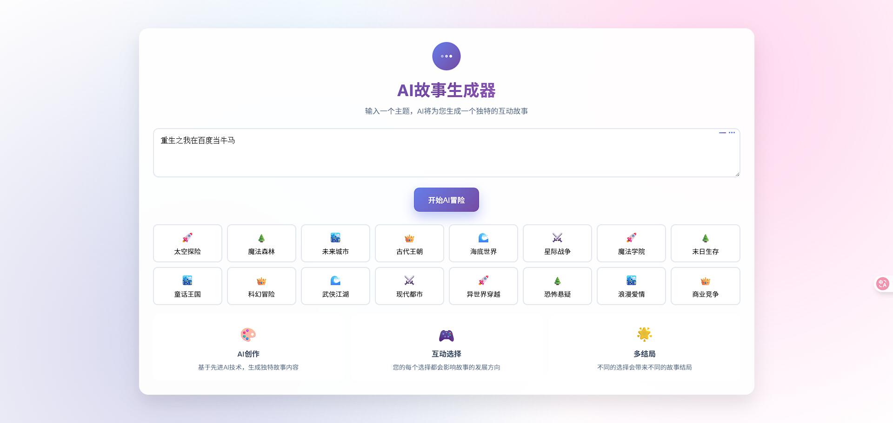
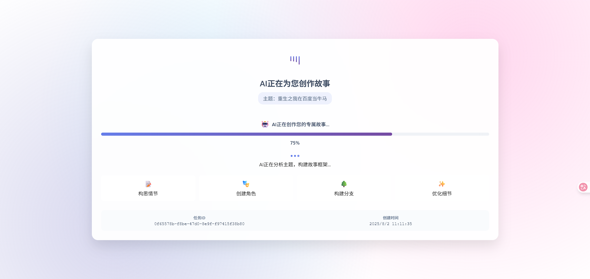
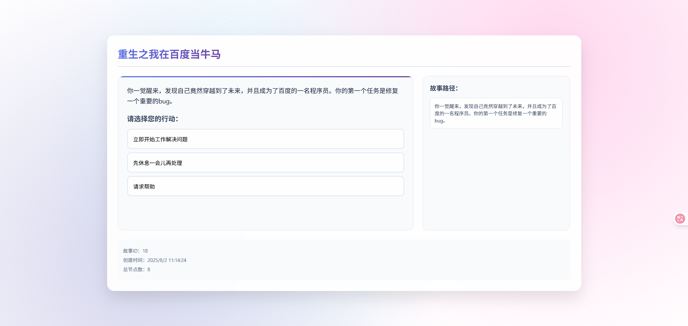
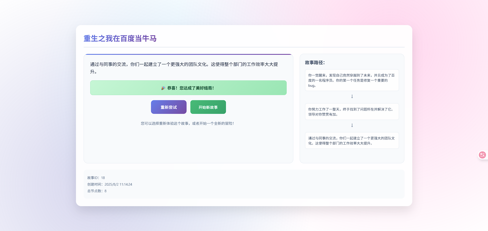
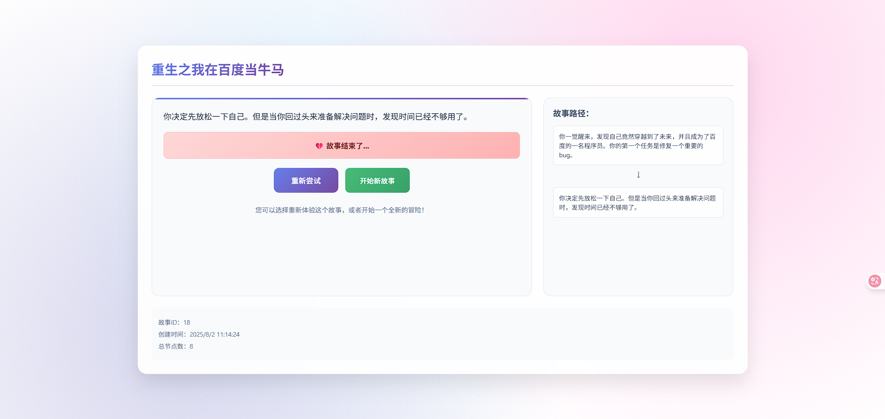

# Adventure Story Generator

一个基于大语言模型的互动故事生成器，使用Python和FastAPI构建。

## 项目概述

Adventure Story Generator是一个AI驱动的互动故事创作平台，可以根据用户指定的主题自动生成完整的互动故事。该项目利用大语言模型（LLM）生成故事内容，并提供RESTful API接口供用户交互。

## 技术栈

- **后端框架**: FastAPI
- **数据库**: SQLAlchemy + SQLite
- **AI模型**: 阿里云Qwen-Max (通过DashScope API)
- **语言**: Python 3.12

## 功能特性

- [x] 基于主题的互动故事自动生成
- [x] 完整的故事树结构存储与查询
- [x] 异步任务处理
- [x] RESTful API接口
- [x] 数据库持久化存储

## API接口

### 故事任务管理
- `POST /api/stories/create` - 创建新的故事生成任务
- `GET /api/jobs/{job_id}` - 获取故事生成任务状态
- `GET /api/stories/{story_id}/complete` - 获取完整的故事内容

## 项目结构

```
adventure/
├── api/              # API路由定义
├── core/             # 核心模块（模型、配置、提示词）
├── db/               # 数据库相关代码
├── models/           # 数据库模型
├── schemas/          # Pydantic模型和数据结构
└── main.py          # 应用入口
```
## 前端仓库

前端项目地址: [Adventure Story Frontend](https://github.com/wieszheng/adventure-web)

前端技术栈:
- **前端**: React 19 + TypeScript
- **构建工具**: Vite
- **HTTP客户端**: Axios
- **样式**: CSS3 (渐变、动画、响应式)

## 项目预览








## 快速开始

### 环境要求
- Python 3.12+
- pip包管理器

### 安装步骤

1. 克隆项目代码
```bash
git clone <项目地址>
cd adventure
```


2. 使用uv安装依赖
```bash
# 如果已安装uv
uv sync

# 或者如果未安装uv，先安装uv再同步依赖
pip install uv
uv sync
```


3. 配置环境变量
```bash
cp .env.example .env
# 编辑.env文件，填入必要的配置信息
```


4. 运行应用
```bash
# 使用uvicorn运行应用
uvicorn main:app --reload

# 或者使用uv run命令运行
uv run uvicorn main:app --reload
```


应用将运行在 `http://localhost:8000`

## 配置说明

在 `.env` 文件中配置以下参数：

```env
DATABASE_URL=sqlite:///./story.db
OPENAI_API_KEY=your_api_key_here
```


## 数据库设计

### Story表
- id: 故事ID
- title: 故事标题
- session_id: 会话ID
- created_at: 创建时间

### StoryNode表
- id: 节点ID
- story_id: 关联的故事ID
- content: 节点内容
- is_root: 是否为根节点
- is_ending: 是否为结束节点
- is_winning_ending: 是否为胜利结局
- options: 节点选项（JSON格式）

### StoryJob表
- job_id: 任务ID
- session_id: 会话ID
- theme: 故事主题
- status: 任务状态
- story_id: 关联的故事ID
- created_at: 创建时间
- completed_at: 完成时间
- error: 错误信息

## 开发指南

### 添加新功能

1. 在`schemas/`目录下定义数据模型
2. 在`models/`目录下创建对应的数据库模型
3. 在`api/`目录下添加相应的路由
4. 在`core/`目录下实现业务逻辑

## 部署说明

可以使用以下方式部署应用：

1. **使用Docker**（推荐）
2. **直接部署到服务器**
3. **使用云服务**（如阿里云、AWS等）

## 贡献指南

欢迎提交Issue和Pull Request来改进项目。

## 许可证

MIT License